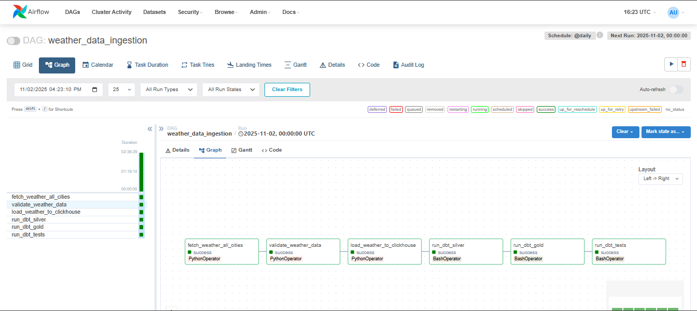
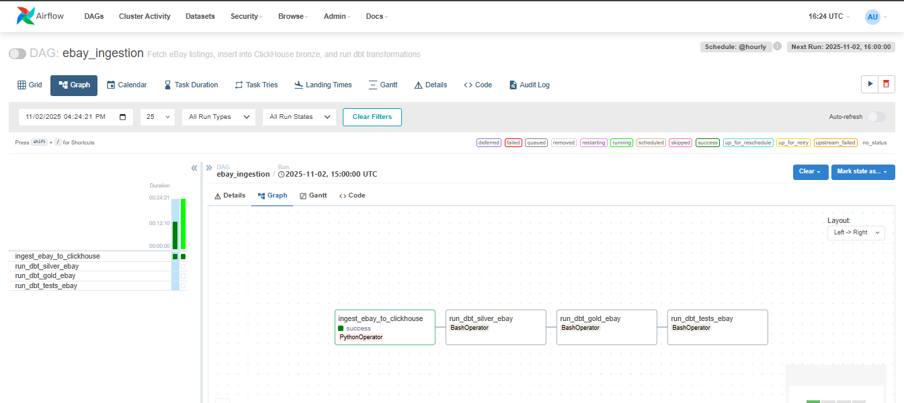
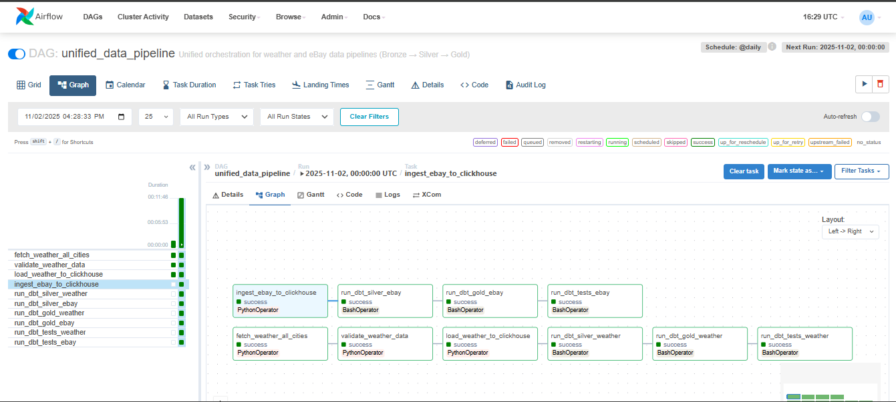
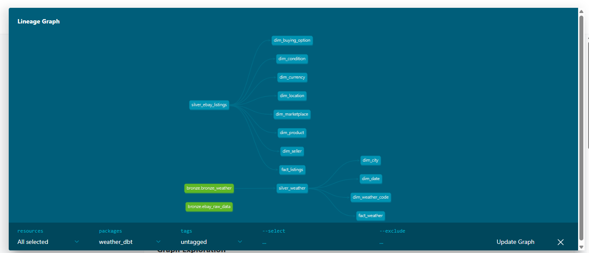

**[Data Governance & Visualization - Project 3 README](project3/README.md)**

## Project: Weather x eBay Analytics (East Coast)

### Overview
This project analyzes how US East Coast weather affects eBay marketplace activity. We join daily weather records with collected eBay listing snapshots to study listing volume, pricing, shipping choices, category demand shifts, seller behavior, and listing quality under different weather conditions.

### Business Questions
1. How do weather conditions (rain, extreme heat/cold) impact daily listings on the East Coast?
2. Does weather influence pricing? Are certain product types priced higher/lower during extreme weather?
3. What is the relationship between weather and shipping choices (free shipping, shipping cost)?
4. Are there shifts in product category demand under specific weather conditions?
5. Do seller performance metrics correlate with weather-driven listing activity?
6. (Bonus) Does weather impact listing quality (e.g., shorter titles, buying options)?
7. (Bonus) Which US East Coast zip code prefixes show the largest price/availability variation with changing weather?

## Architecture

### Architecture Overview

```
┌─────────────────────────────────────────────────────────────────────────────┐
│                         DATA SOURCES                                         │
├─────────────────────────────────────────────────────────────────────────────┤
│                                                                               │
│  ┌──────────────────┐                    ┌──────────────────┐               │
│  │  Open-Meteo API │                    │  eBay Browse API │               │
│  │  (Weather Data) │                    │  (Listing Data)  │               │
│  └────────┬─────────┘                    └────────┬─────────┘               │
│           │                                      │                           │
│           └──────────────┬───────────────────────┘                           │
│                          ▼                                                     │
│              ┌─────────────────────┐                                         │
│              │  Apache Airflow     │                                         │
│              │  (Orchestration)   │                                         │
│              │  - Scheduler        │                                         │
│              │  - Webserver (8080) │                                         │
│              └──────────┬──────────┘                                         │
│                         │                                                     │
│                         ▼                                                     │
│        ┌──────────────────────────────────────┐                            │
│        │      Docker Container Environment     │                            │
│        │  ┌────────────────────────────────┐  │                            │
│        │  │    PostgreSQL (Airflow DB)     │  │                            │
│        │  └────────────────────────────────┘  │                            │
│        │                                        │                            │
│        │  ┌────────────────────────────────┐  │                            │
│        │  │       ClickHouse Server        │  │                            │
│        │  │      (Data Warehouse)          │  │                            │
│        │  │      Port: 8123, 9000          │  │                            │
│        │  └────────────┬───────────────────┘  │                            │
│        │               │                       │                            │
│        │               ▼                       │                            │
│        │    ┌──────────────────────┐          │                            │
│        │    │   BRONZE LAYER       │          │                            │
│        │    │  (Raw Ingestion)     │          │                            │
│        │    │                      │          │                            │
│        │    │ • bronze_weather     │          │                            │
│        │    │ • bronze.ebay_raw_data│         │                            │
│        │    └──────────┬───────────┘          │                            │
│        │               │                       │                            │
│        │               ▼                       │                            │
│        │    ┌──────────────────────┐          │                            │
│        │    │    SILVER LAYER      │          │                            │
│        │    │  (dbt Transformations)│          │                            │
│        │    │                      │          │                            │
│        │    │ • silver_weather     │          │                            │
│        │    │ • silver_ebay_listings│         │                            │
│        │    │                      │          │                            │
│        │    │ Data Quality Checks: │          │                            │
│        │    │ - Null handling      │          │                            │
│        │    │ - Deduplication     │          │                            │
│        │    │ - Standardization   │          │                            │
│        │    └──────────┬───────────┘          │                            │
│        │               │                       │                            │
│        │               ▼                       │                            │
│        │    ┌──────────────────────┐          │                            │
│        │    │     GOLD LAYER       │          │                            │
│        │    │ (Star Schema - dbt)  │          │                            │
│        │    │                      │          │                            │
│        │    │ FACT TABLES:         │          │                            │
│        │    │ • fact_weather      │          │                            │
│        │    │ • fact_listings     │          │                            │
│        │    │                      │          │                            │
│        │    │ DIMENSION TABLES:    │          │                            │
│        │    │ • dim_date          │          │                            │
│        │    │ • dim_city          │          │                            │
│        │    │ • dim_weather_code   │          │                            │
│        │    │ • dim_product       │          │                            │
│        │    │ • dim_location      │          │                            │
│        │    │ • dim_seller        │          │                            │
│        │    │ • dim_marketplace   │          │                            │
│        │    │ • dim_currency      │          │                            │
│        │    │ • dim_condition     │          │                            │
│        │    │ • dim_buying_option │          │                            │
│        │    └──────────┬───────────┘          │                            │
│        └───────────────┼───────────────────────┘                            │
│                        │                                                     │
│                        ▼                                                     │
│              ┌─────────────────────┐                                         │
│              │  Analytical Queries │                                         │
│              │  (ClickHouse SQL)   │                                         │
│              │                     │                                         │
│              │ • Weather impact on listings                                  │
│              │ • Pricing behavior analysis                                   │
│              │ • Shipping choices analysis                                   │
│              │ • Category demand shifts                                      │
│              │ • Seller performance metrics                                   │
│              │ • Listing quality metrics (bonus)                              │
│              │ • ZIP code variation (bonus)                                   │
│              └──────────┬───────────┘                                         │
│                         │                                                     │
│                         ▼                                                     │
│              ┌─────────────────────┐                                         │
│              │  Results & Reports  │                                         │
│              │                     │                                         │
│              │ • JSON results      │                                         │
│              │ • Markdown reports  │                                         │
│              │ • Business insights │                                         │
│              └─────────────────────┘                                         │
└─────────────────────────────────────────────────────────────────────────────┘

KEY COMPONENTS:
━━━━━━━━━━━━━━━━━━━━━━━━━━━━━━━━━━━━━━━━━━━━━━━━━━━━━━━━━━━━━━━━━━━━━━━━━━━━━

ORCHESTRATION LAYER
  • Apache Airflow 2.8+ (DAGs, scheduling, monitoring)
  • Docker Compose (service orchestration)
  • PostgreSQL (Airflow metadata storage)

DATA STORAGE LAYER
  • ClickHouse 23+ (columnar database for analytical workloads)
  • Bronze: Raw ingested data (no transformations)
  • Silver: Cleaned, standardized data (dbt models)
  • Gold: Star schema (fact + dimension tables, dbt models)

TRANSFORMATION LAYER
  • dbt 1.6+ (SQL-based transformations)
  • Data quality tests (null checks, uniqueness, range validation)
  • Incremental models for efficiency

ANALYTICS LAYER
  • ClickHouse SQL queries against gold layer
  • 7 analytical queries answering business questions
  • Automated report generation

DATA FLOW:
━━━━━━━━━━━━━━━━━━━━━━━━━━━━━━━━━━━━━━━━━━━━━━━━━━━━━━━━━━━━━━━━━━━━━━━━━━━━━

1. APIs → Airflow PythonOperators → ClickHouse Bronze
2. Bronze → dbt Silver (cleaning & validation)
3. Silver → dbt Gold (star schema modeling)
4. Gold → Analytical SQL Queries → Reports
```

### Tech Stack
- **Orchestration**: Apache Airflow 2.8+ (DAGs for data pipeline automation)
- **Data Warehouse**: ClickHouse 23+ (columnar database for analytical workloads)
- **Transformations**: dbt 1.6+ (SQL-based transformations following medallion architecture)
- **Containerization**: Docker & Docker Compose (service orchestration)
- **Metadata Store**: PostgreSQL 13+ (Airflow metadata database)

### Data Flow (Medallion Architecture)

**Data Sources:**
- Weather: Open-Meteo API (hourly/daily weather for East Coast locations)
- eBay: eBay Browse API (listing snapshots)

**Pipeline Stages:**
1. **Bronze Layer (Raw Data)**: 
   - ClickHouse tables: `bronze_weather`, `bronze.ebay_raw_data`
   - Ingested via Airflow PythonOperators
   
2. **Silver Layer (Cleaned Data)**:
   - dbt models: `silver_weather`, `silver_ebay_listings`
   - Data quality checks, cleaning, standardization
   
3. **Gold Layer (Analytical Models)**:
   - Star schema: Fact tables (`fact_weather`, `fact_listings`) + Dimension tables (11 dim_* tables)
   - dbt transformations creating denormalized analytical-ready data

4. **Analytics**:
   - ClickHouse SQL queries against gold layer
   - Parameterized queries grouped by weather buckets and dimensions

### Architecture Diagrams

**System Architecture Diagram:**


**Additional Diagrams:**
- **System Architecture Source**: `Data_Architecture/Data_Architecture.drawio.(png|pdf)` - *Note: May show legacy architecture; actual implementation uses Airflow + ClickHouse + dbt*
- **Data Model**: `Star_Schema/Data_Eng_2025_group2.drawio.(png|pdf)` - Star schema design
- **Visual DAGs**: See "Airflow and dbt DAG Visuals" section below for pipeline screenshots

---

## Project Deliverables 

### Pipeline Design & Airflow DAGs 
**Location**: 
- **Airflow DAGs**: 
  - `project/airflow/dags/weather_ingestion_dag.py` - Weather data ingestion pipeline
  - `project/airflow/dags/ebay_ingestion_dag.py` - eBay data ingestion pipeline
  - `project/airflow/dags/unified_pipeline_dag.py` - Unified orchestration DAG
- **DAG Documentation**: 
  - `project/airflow/dags/README_DAGS.md` - Complete DAG documentation
- **DAG Utilities**:
  - `project/airflow/dags/utils/weather_api.py` - Weather API integration
  - `project/airflow/dags/utils/ebay_ingestion.py` - eBay API integration
  - `project/airflow/dags/utils/clickhouse_loader.py` - ClickHouse data loader
- **Screenshots**: Available in `screenshots/` directory and displayed in "Airflow and dbt DAG Visuals" section below
  - `screenshots/weather-data-ingestion.png` - Weather Data Ingestion DAG
  - `screenshots/ebay-ingestion.png` - eBay Ingestion DAG
  - `screenshots/unified-data-pipeline.png` - Unified Data Pipeline DAG
  - `screenshots/lineage-graph.png` - dbt Lineage Graph (medallion architecture visualization)
- **Key Features**:
  - Two distinct data sources (Weather API, eBay API)
  - Automated ingestion with parameterization (date, file_version, items_per_product)
  - Data quality checks (nulls, duplicates, range checks)
  - Idempotent pipelines (no duplicates on re-run)

### ClickHouse Schema & Medallion Layers 
**Location**:
- **Schema Definition**:
  - `project/airflow/dbt/models/sources.yml` - Bronze layer source definitions
  - `project/airflow/dbt/models/gold/schema.yml` - Gold layer schema documentation
- **Medallion Architecture**:
  - **Bronze Layer**: 
    - `bronze_weather` table (loaded via `clickhouse_loader.py`)
    - `bronze.ebay_raw_data` table (loaded via `ebay_ingestion.py`)
  - **Silver Layer**: 
    - `project/airflow/dbt/models/silver/silver_weather.sql`
    - `project/airflow/dbt/models/silver/silver_ebay_listings.sql`
  - **Gold Layer**: 
    - `project/airflow/dbt/models/gold/fact_weather.sql`
    - `project/airflow/dbt/models/gold/fact_listings.sql`
    - `project/airflow/dbt/models/gold/dim_*.sql` (11 dimension tables)
- **Architecture Diagrams**:
  - `Data_Architecture/Data_Architecture.drawio.(png|pdf)` - System architecture
  - `Star_Schema/Data_Eng_2025_group2.drawio.(png|pdf)` - Data model schema
- **Physical Structure**: Designed for analytical queries with star schema supporting incremental updates

### dbt Transformations & Tests  
**Location**:
- **dbt Project Configuration**:
  - `project/airflow/dbt/dbt_project.yml` - dbt project configuration
  - `project/airflow/dbt/profiles.yml` - ClickHouse connection profile
- **Transformations**:
  - Silver Models: `project/airflow/dbt/models/silver/*.sql`
  - Gold Models: `project/airflow/dbt/models/gold/*.sql`
    - Fact models: `fact_weather.sql`, `fact_listings.sql`
    - Dimension models: 11 dimension tables (dim_date, dim_city, dim_product, etc.)
- **Tests**:
  - `project/airflow/dbt/models/gold/schema.yml` - Contains all data quality tests
    - `not_null` tests on essential columns
    - `unique` tests on dimension keys (dim_date.date_time, dim_city.city, dim_weather_code.weather_code)
- **Documentation**:
  - `project/airflow/dbt/models/sources.yml` - Bronze layer documentation
  - `project/airflow/dbt/models/gold/schema.yml` - Gold layer documentation with column descriptions
- **Dependencies**: Expressed via `{{ ref() }}` and `{{ source() }}` macros throughout models
- **Integration**: All dbt transformations are integrated into Airflow DAGs via BashOperators

### Architecture & Documentation  
**Location**:
- **Main Documentation**:
  - `README.md` - This file (complete project documentation)
  - `project/airflow/dags/README_DAGS.md` - Detailed DAG documentation
  - `sql_queries_clickhouse/README.md` - Analytical queries documentation
- **Architecture Diagrams**:
  - `Data_Architecture/Data_Architecture.drawio.(png|pdf)` - System architecture diagram
  - `Star_Schema/Data_Eng_2025_group2.drawio.(png|pdf)` - Star schema diagram
- **Setup Instructions**:
  - See "Project Setup Instructions" section in README.md
  - Environment variables and dependencies documented
- **Docker Configuration**:
  - `project/airflow/compose.yml` - Complete Docker Compose setup
  - All services configured (Airflow, ClickHouse, PostgreSQL)
- **Data Dictionaries**:
  - `data_dictionaries/ebay_data_dict.json` - eBay data dictionary
  - `data_dictionaries/weather_data_dict.json` - Weather data dictionary

### Analytical Queries & Results  
**Location**:
- **SQL Queries** (ClickHouse syntax):
  - `sql_queries_clickhouse/impact_listings_by_weather.sql`
  - `sql_queries_clickhouse/pricing_behavior_by_weather_and_product.sql`
  - `sql_queries_clickhouse/shipping_choices_vs_weather.sql`
  - `sql_queries_clickhouse/category_demand_shifts_by_weather.sql`
  - `sql_queries_clickhouse/seller_performance_vs_weather.sql`
  - `sql_queries_clickhouse/bonus_listing_quality_vs_weather.sql`
  - `sql_queries_clickhouse/bonus_zip_prefix_variation.sql`
- **Query Execution**: 
  - `sql_queries_clickhouse/run_queries_docker.ps1` - PowerShell script to run all queries
  - `sql_queries_clickhouse/run_analytical_queries.py` - Python script for query execution
  - `sql_queries_clickhouse/generate_report.py` - Report generation script
- **Results**: See "Analytical Query Results" section below for detailed findings

### Optional MongoDB Integration  
**Status**: Not implemented
**Note**: This project uses ClickHouse as the primary data warehouse instead of MongoDB. The medallion architecture (Bronze → Silver → Gold) is fully implemented in ClickHouse with dbt transformations.

---

## Quick Reference: Finding Key Components

| Component | File/Directory Path |
|-----------|---------------------|
| **Airflow DAGs** | `project/airflow/dags/*.py` |
| **dbt Models** | `project/airflow/dbt/models/` |
| **dbt Tests** | `project/airflow/dbt/models/gold/schema.yml` |
| **ClickHouse Schema** | `project/airflow/dbt/models/sources.yml` |
| **Bronze Layer** | Loaded via `clickhouse_loader.py` and `ebay_ingestion.py` |
| **Silver Layer** | `project/airflow/dbt/models/silver/*.sql` |
| **Gold Layer** | `project/airflow/dbt/models/gold/*.sql` |
| **Analytical Queries** | `sql_queries_clickhouse/*.sql` |
| **Query Results** | `sql_queries_clickhouse/results/*.json` and `ANALYTICAL_RESULTS_REPORT.md` |
| **Results Report** | `sql_queries_clickhouse/ANALYTICAL_RESULTS_REPORT.md` |
| **Architecture Diagrams** | `Data_Architecture/`, `Star_Schema/` |
| **Docker Setup** | `project/airflow/compose.yml` |
| **Documentation** | `README.md`, `project/airflow/dags/README_DAGS.md` |

---

## Repository Structure

**Key Directories:**
- `project/airflow/`: Main pipeline (DAGs, dbt, Docker Compose)
- `sql_queries_clickhouse/`: Analytical SQL queries (ClickHouse syntax)
- `Data_Architecture/`, `Star_Schema/`: Architecture diagrams
- `data_dictionaries/`: Data field dictionaries
- `ebay_api_scripts/`, `Kubernetes_ebay/`: Legacy eBay collection scripts (optional)

For detailed file locations, see "Quick Reference: Finding Key Components" section above.

## Data Dictionary

Complete data dictionaries are available in JSON format:
- **Weather Data**: `data_dictionaries/weather_data_dict.json`
- **eBay Data**: `data_dictionaries/ebay_data_dict.json`

### Weather Data (Bronze Layer)

Raw weather data ingested from Open-Meteo API into `bronze_weather` table:

| Column | Description | Type | Nullable |
|---|---|---|---|
| `time` | Timestamp of weather observation | DateTime | No |
| `city` | City/region name | String | No |
| `weather_code` | Weather condition code (WMO) | Integer | No |
| `temperature_2m` | Temperature at 2m height (°C) | Float | Yes |
| `rain` | Rainfall amount (mm) | Float | Yes |
| `relative_humidity_2m` | Relative humidity at 2m (%) | Integer | Yes |
| `cloudcover` | Cloud cover percentage | Float | Yes |
| `sunshine_duration` | Duration of direct sunlight (seconds) | Integer | Yes |
| `wind_speed_10m` | Average wind speed at 10m (m/s) | Float | Yes |

**Note**: The JSON dictionary (`weather_data_dict.json`) contains additional fields from the API (e.g., `temperature_mean`, `temperature_max`, `temperature_min`, `rain_sum`, `snow_sum`, `daylight_duration`, `sunlight_duration`, `wind_speed`, `uv_index`) which may be available in future API versions.

### eBay Data (Bronze Layer)

Raw eBay listing data ingested from eBay Browse API into `bronze.ebay_raw_data` table:

| Column | Description | Type | Nullable |
|---|---|---|---|
| `item_id` | Unique eBay item identifier | String | No |
| `collection_timestamp` | Timestamp when data was collected | DateTime | No |
| `timezone` | Timezone of data collection | String | No |
| `product_type` | Category/type of listed product | String | No |
| `price` | Item price | Float | No |
| `currency` | Currency code (e.g., USD, GBP) | String | No |
| `seller_feedback_score` | Absolute feedback score of seller | Integer | Yes |
| `seller_feedback_percentage` | Seller's positive feedback percentage | Float | Yes |
| `item_location` | Location of the listed item | String | Yes |
| `seller_location` | Location of the seller | String | Yes |
| `shipping_cost` | Shipping cost in given currency | Float | Yes |
| `free_shipping` | Indicator whether shipping is free (0/1) | Boolean | No |
| `condition` | Condition of item (e.g., New, Used) | String | No |
| `buying_options` | Available purchase options (e.g., Buy It Now, Auction) | String | No |
| `title_length` | Length of the product title in characters | Integer | Yes |
| `marketplace_id` | Identifier for the marketplace (e.g., ebay_us) | String | No |
| `weather_category` | Weather condition category (optional) | String | Yes |

**Full Schema**: See `data_dictionaries/ebay_data_dict.json` for complete field descriptions and examples.

## Star Schema (Analytical Model)
Grain: one row per collected listing event.

- Fact: `fact_listings`
  - Degenerate: `item_id`
  - Measures: `price`, `shipping_cost`, `free_shipping`, `title_length`
  - Foreign keys: `date_key`, `location_key`, `product_key`, `seller_key`, `marketplace_key`, `currency_key`, `condition_key`, `buying_option_key`
- Dimensions:
  - `dim_date` (calendar; `date_key = DATE(collection_timestamp)`)
  - `dim_location` (city/region/state/country/zip_prefix)
  - `dim_product` (`product_type`)
  - `dim_seller` (binned `seller_feedback_score`, `seller_feedback_percentage`)
  - `dim_marketplace`, `dim_currency`, `dim_condition`, `dim_buying_option`
  - Weather daily table joined by `(date, location_key)` with fields: `temperature_2m`, `rain`, `sunshine_duration`, `wind_speed_10m`, optional `weather_category`

East Coast filter states: `ME,NH,VT,MA,RI,CT,NY,NJ,PA,DE,MD,DC,VA,NC,SC,GA,FL`.

## Project Setup Instructions

This project uses **Docker Compose** to orchestrate Airflow, ClickHouse, and dbt for a complete medallion architecture data pipeline.

### Prerequisites
- **Docker Desktop** installed and running ([Download](https://www.docker.com/products/docker-desktop/))
- **Git** for cloning the repository
- **Windows 10+** or **macOS/Linux**

### Step 1: Clone and Navigate
```bash
git clone <repository-url>
cd data_eng_2025_group2
```

### Step 2: Configure Environment Variables

#### eBay API Credentials (Required)
Create or edit `credentials.env` in the project root:
```bash
EBAY_CLIENT_ID=your_ebay_client_id
EBAY_CLIENT_SECRET=your_ebay_client_secret
```

**Getting eBay API Credentials:**
1. Go to [eBay Developers Program](https://developer.ebay.com/)
2. Register and create a new application
3. Copy your **Client ID** and **Client Secret**
4. Save them to `credentials.env`

#### Airflow Variables (Set via UI)
After starting Airflow, set these in the Airflow UI (`Admin > Variables`):
- `EBAY_CLIENT_ID` = `your_ebay_client_id`
- `EBAY_CLIENT_SECRET` = `your_ebay_client_secret`
- `enable_ebay_silver` = `true` (to enable eBay dbt transformations)
- `EBAY_ITEMS_PER_PRODUCT` = `200` (optional, default: 200 - number of items to fetch per product type)

### Step 3: Start Docker Containers

Navigate to the Airflow project directory:
```bash
cd project/airflow
```

Initialize Airflow (first time only):
```bash
docker compose up airflow-init
```

Wait for: `User admin created` message, then start all services:
```bash
docker compose up -d
```

This starts:
- **Airflow Webserver** (UI at http://localhost:8080)
- **Airflow Scheduler** (runs DAGs)
- **PostgreSQL** (Airflow metadata)
- **ClickHouse** (data warehouse)

### Step 4: Verify Services

Check running containers:
```bash
docker ps
```

You should see:
- `airflow-webserver`
- `airflow-scheduler`
- `clickhouse-server`
- `airflow-db` (PostgreSQL)

Access services:
- **Airflow UI**: http://localhost:8080 (admin/admin)
- **ClickHouse**: localhost:8123 (default/mypassword)

### Step 5: Access Airflow Web UI

1. Open browser: http://localhost:8080
2. Login: `admin` / `admin`
3. Find DAGs:
   - `weather_data_ingestion` - Weather pipeline
   - `ebay_ingestion` - eBay pipeline
   - `unified_data_pipeline` - Combined orchestration

### Step 6: Enable DAGs and Run

1. In Airflow UI, toggle DAGs **ON** (green switch)
2. Set Airflow Variable `enable_ebay_silver = true` (Admin > Variables)
3. Trigger a DAG run or wait for scheduled execution

---

## Data Ingestion Parameterization

The pipelines support parameterization for flexible data ingestion:

### Weather Data Ingestion Parameters

**Available Parameters:**
- `execution_date`: Automatically set via Airflow macro `{{ ds }}` (execution date in YYYY-MM-DD format)
- `file_version`: Currently hardcoded to `"v1"` in DAG (can be customized in `weather_ingestion_dag.py`)

**Usage:**
- Date parameter: Automatically uses the DAG execution date to fetch weather for the previous day
- File version: Used for file naming and data lineage tracking
- Example: For execution date `2025-11-02`, fetches weather for `2025-11-01` and saves as `east_coast_weather_v1_2025-11-02.csv`

### eBay Data Ingestion Parameters

**Available Parameters:**
- `items_per_product`: Number of items to fetch per product type (configurable via Airflow Variable)

**Configuration:**
1. **Via Airflow Variables** (recommended):
   - Variable: `EBAY_ITEMS_PER_PRODUCT`
   - Default: `200` (if not set)
   - Range: Typically 1-500 items per product type
   
2. **Effect:**
   - Controls how many eBay listings are collected for each product type
   - Higher values = more data but longer execution time
   - Lower values = faster execution but less data coverage

**Example Configuration:**
```
# In Airflow UI: Admin > Variables
EBAY_ITEMS_PER_PRODUCT = 200  # Standard collection
EBAY_ITEMS_PER_PRODUCT = 100  # Quick test run
EBAY_ITEMS_PER_PRODUCT = 500  # Comprehensive collection
```

### Parameter Benefits

**Flexibility**: Adjust data collection volume without code changes  
**Idempotency**: Date-based parameters ensure consistent file naming and prevent duplicates  
**Scalability**: Easy to adjust `items_per_product` based on API quotas and processing needs  
**Traceability**: File versioning helps track different data collection runs

---

## 📦 Dependencies

### Docker Services
- **Apache Airflow** 2.8+ (orchestration)
- **ClickHouse** 23+ (data warehouse)
- **PostgreSQL** 13+ (Airflow metadata)
- **dbt** 1.6+ (data transformations)

### Python Packages (installed in containers)
```
apache-airflow
clickhouse-connect
pandas
requests
dbt-clickhouse
```

### External APIs
- **Open-Meteo API** (free, no auth required)
- **eBay Browse API** (requires credentials)

---

## Airflow and dbt DAG Visuals

This section contains screenshots and visuals of all Airflow DAGs and dbt model dependencies.

**Available Screenshots:**
- Weather Data Ingestion DAG (`screenshots/weather-data-ingestion.png`)
- eBay Ingestion DAG (`screenshots/ebay-ingestion.png`)
- Unified Data Pipeline DAG (`screenshots/unified-data-pipeline.png`)
- dbt Lineage Graph (`screenshots/lineage-graph.png`)

### Airflow DAG Views

#### 1. Weather Data Ingestion DAG
**Location**: Airflow UI → `weather_data_ingestion`

**Visual Structure**:
```
fetch_weather_all_cities
    ↓
validate_weather_data
    ↓
load_weather_to_clickhouse (Bronze)
    ↓
run_dbt_silver (Silver)
    ↓
run_dbt_gold (Gold)
    ↓
run_dbt_tests (Tests)
```

**Screenshot**:



#### 2. eBay Ingestion DAG
**Location**: Airflow UI → `ebay_ingestion`

**Visual Structure**:
```
ingest_ebay_to_clickhouse (Bronze)
    ↓
run_dbt_silver_ebay (Silver)
    ↓
run_dbt_gold_ebay (Gold)
    ↓
run_dbt_tests_ebay (Tests)
```

**Screenshot**:



#### 3. Unified Data Pipeline DAG
**Location**: Airflow UI → `unified_data_pipeline`

**Visual Structure**:
```
┌─────────────────────────────────────┐
│   Unified Data Pipeline            │
└─────────────────────────────────────┘
           │         │
           ▼         ▼
    ┌──────────┐ ┌──────────┐
    │ Weather  │ │   eBay   │
    │ Pipeline │ │ Pipeline │
    └──────────┘ └──────────┘
      (parallel execution)
```

**Screenshot**:



This screenshot displays the Apache Airflow UI showing the **Graph View** for the `unified_data_pipeline` DAG, demonstrating a unified data pipeline that orchestrates both weather and eBay data processing.

**Key Features Visible:**

1. **Pipeline Status:**
   - **Weather Pipeline (Bottom Row)**: All tasks completed successfully (green borders)
     - `fetch_weather_all_cities` (success)
     - `validate_weather_data` (success)
     - `load_weather_to_clickhouse` (success)
     - `run_dbt_silver_weather` (success)
     - `run_dbt_gold_weather` (success)
     - `run_dbt_tests_weather` (success)

   - **eBay Pipeline (Top Row)**: Tasks executing in sequence
     - `ingest_ebay_to_clickhouse` (running - light blue border)
     - `run_dbt_silver_ebay` (pending - white border)
     - `run_dbt_gold_ebay` (pending - white border)
     - `run_dbt_tests_ebay` (pending - white border)

2. **DAG Information:**
   - **DAG Name**: `unified_data_pipeline`
   - **Description**: "Unified orchestration for weather and eBay data pipelines (Bronze → Silver → Gold)"
   - **View Selected**: Graph View (visual task dependencies)

3. **Task Status Legend:**
   - Shows all possible task states: success (green), running (blue), failed (red), queued (grey), scheduled (orange), skipped (light blue), etc.

4. **Parallel Execution:**
   - Both pipelines run independently in parallel
   - Weather pipeline completes independently of eBay pipeline status
   - Task dependencies shown with connecting arrows

5. **Medallion Architecture Flow:**
   - **Bronze**: Data ingestion tasks (fetch/ingest)
   - **Silver**: dbt transformation tasks (`run_dbt_silver_*`)
   - **Gold**: dbt gold layer tasks (`run_dbt_gold_*`)
   - **Tests**: Data quality validation (`run_dbt_tests_*`)

**What This Demonstrates:**
- Successful orchestration of dual-source data pipeline
- Complete medallion architecture implementation (Bronze → Silver → Gold)
- Independent pipeline execution (weather and eBay run in parallel)
- Automated dbt transformations integrated into Airflow
- Real-time task monitoring and status tracking

**To View This Screenshot:**
1. Navigate to Airflow UI → DAGs → `unified_data_pipeline`
2. Click "Graph View" tab
3. Toggle a DAG run to see execution in real-time

### dbt DAG Views

**dbt Lineage Graph Screenshot**:



This graph visualizes the complete data flow through the medallion architecture:
- **Bronze Layer** (sources): `bronze.bronze_weather` and `bronze.ebay_raw_data`
- **Silver Layer**: `silver_weather` and `silver_ebay_listings` (data cleaning and transformation)
- **Gold Layer**: Dimension and fact tables for analytical queries

**dbt Model Dependencies**:
```
Bronze Layer:
  ├── bronze_weather (source)
  └── ebay_raw_data (source)

Silver Layer:
  ├── silver_weather
  └── silver_ebay_listings

Gold Layer:
  ├── fact_weather
  ├── fact_listings
  ├── dim_date
  ├── dim_city
  ├── dim_weather_code
  ├── dim_product
  ├── dim_location
  ├── dim_seller
  ├── dim_marketplace
  ├── dim_currency
  ├── dim_condition
  └── dim_buying_option
```

---

## Analytical Query Results

### Results Summary

All 7 analytical queries have been executed against the ClickHouse gold layer. Detailed results are available in:
- **Full Report**: `sql_queries_clickhouse/ANALYTICAL_RESULTS_REPORT.md`
- **Raw JSON Data**: `sql_queries_clickhouse/results/*.json`

### Key Findings

#### 1. Impact of Weather on Daily Listings
**Query**: `impact_listings_by_weather.sql`

| Weather Condition | Total Listings | Unique Items | Average Price |
|-------------------|----------------|--------------|---------------|
| **Extreme Cold** | 700 | 145 | $20.35 |
| **Extreme Heat** | 440 | 88 | $50.94 |
| **Normal** | 258 | 53 | $81.41 |
| **Precipitation-Heavy** | 265 | 53 | $38.18 |

**Insight**: Extreme Cold conditions drive highest listing volume (700 listings) but lowest prices, suggesting urgent demand for warming products.

#### 2. Shipping Choices vs Weather
**Query**: `shipping_choices_vs_weather.sql`

| Weather Condition | Free Shipping Rate | Avg Paid Shipping Cost |
|-------------------|-------------------|------------------------|
| **Extreme Cold** | 92.9% | $5.38 |
| **Extreme Heat** | **100%** | N/A (all free) |
| **Normal** | 86.4% | $1.99 |
| **Precipitation-Heavy** | 84.9% | $9.11 |

**Insight**: Extreme Heat shows 100% free shipping rate - sellers maximize convenience during heat-related product demand.

#### 3. Category Demand Shifts by Weather
**Query**: `category_demand_shifts_by_weather.sql`

**Top Products by Weather:**
- **Extreme Cold**: Hand warmers (33.6%), Scarves (32.1%), Ear muffs (10.0%)
- **Extreme Heat**: Sunglasses (43.2%), Aloe vera gel (13.6%), Air conditioners (11.4%)
- **Precipitation-Heavy**: Umbrellas (45.3%), Rain boots (18.9%), Rain jackets (5.7%)
- **Normal**: Beach towels (23.3%), Bird feeders (23.3%), Swimming pools (11.6%)

**Insight**: Clear weather-driven product demand patterns - each condition drives specific category spikes.

#### 4. Pricing Behavior by Weather and Product
**Query**: `pricing_behavior_by_weather_and_product.sql`

**Key Examples**:
- **Air conditioners** (Extreme Heat): Avg $93.37, Range $9.17-$683.57 (high volatility)
- **Hand warmers** (Extreme Cold): Avg $23.31, Range $12.99-$47.99 (consistent pricing)
- **Umbrellas** (Precipitation): Avg $46.12, Range $1-$550 (widest range)

**Insight**: Premium products (air conditioners) show high price volatility during extreme weather, while simple items maintain stable pricing.

#### 5. Seller Performance vs Weather
**Query**: `seller_performance_vs_weather.sql`

| Weather Condition | Top Seller Tier | Market Share | Avg Price |
|-------------------|-----------------|--------------|-----------|
| **Extreme Cold** | Very High (5000+) | 78.8% | $11.43-$36.22 |
| **Extreme Heat** | Very High (5000+) | 67.1% | $54.27 |
| **Precipitation-Heavy** | High (1000-4999) | 51.4% | $17.23 |

**Insight**: Premium sellers (Very High feedback, 5000+) dominate during Extreme Cold and Extreme Heat conditions, commanding higher market shares.

#### 6. Listing Quality vs Weather (Bonus)
**Query**: `bonus_listing_quality_vs_weather.sql`

| Weather Condition | Avg Title Length | Quality Score |
|-------------------|-----------------|---------------|
| **Extreme Cold** | 74.6-76.1 chars | 6.34-46.79 |
| **Extreme Heat** | 71.0-72.6 chars | 7.63-23.79 |
| **Normal** | 63.3-70.0 chars | 5.38-12.12 |

**Insight**: Extreme Cold listings have longest titles and highest quality scores, indicating more detailed product descriptions.

#### 7. Zip Prefix Price Variation (Bonus)
**Query**: `bonus_zip_prefix_variation.sql`

**Top ZIP Areas**:
- **ZIP 113** (NYC): 34.4% market share during Extreme Cold, avg $11.62
- **ZIP 331** (Miami): Highest prices during Extreme Heat ($68.58), high volatility
- **ZIP 100** (NYC): Highest price volatility during Precipitation ($103.78 avg, $170.56 stddev)

**Insight**: Major metropolitan areas show different pricing patterns - NYC dominates volume, Miami shows premium pricing during heat.

### Running Analytical Queries

**Recommended Method**: Use the PowerShell script to run all queries:

```bash
cd sql_queries_clickhouse
powershell -ExecutionPolicy Bypass -File run_queries_docker.ps1
```

This generates JSON results in `sql_queries_clickhouse/results/*.json`.

**Generate Report**: After running queries, automatically generate the markdown report:

```bash
cd sql_queries_clickhouse
python generate_report.py
```

This creates `ANALYTICAL_RESULTS_REPORT.md` with formatted tables and insights.

**Alternative**: Query directly via ClickHouse client:
```bash
docker exec clickhouse-server clickhouse-client --password mypassword --query "$(cat sql_queries_clickhouse/impact_listings_by_weather.sql)"
```

---

## Manual Setup (Alternative to Docker)

If you prefer not to use Docker, you can set up components manually:

### Manual Prerequisites
- Python 3.10+
- PostgreSQL 13+
- ClickHouse 23+
- Airflow 2.8+

### Install Python Dependencies
```bash
pip install -r ebay_api_scripts/requirements.txt
pip install -r project/airflow/requirements.txt
pip install clickhouse-connect dbt-clickhouse
```

### Configure ClickHouse
1. Install ClickHouse: https://clickhouse.com/docs/en/install
2. Start service: `sudo systemctl start clickhouse-server`
3. Create databases and tables (see `project/airflow/dbt/models/sources.yml`)

### Configure Airflow
1. Install Airflow: `pip install apache-airflow`
2. Initialize: `airflow db init`
3. Create admin: `airflow users create --username admin --password admin --role Admin`
4. Start scheduler: `airflow scheduler`
5. Start webserver: `airflow webserver`

### Obtain eBay API Token
```bash
python ebay_api_scripts/setup_token.py
```

## SQL Analytics

### Query Mapping to Business Questions
Each SQL query corresponds to a specific business question:

| Query # | Business Question | SQL File |
|---------|-------------------|----------|
| **1** | How do weather conditions impact daily listings on the East Coast? | `impact_listings_by_weather.sql` |
| **2** | Does weather influence pricing? Are certain product types priced higher/lower during extreme weather? | `pricing_behavior_by_weather_and_product.sql` |
| **3** | What is the relationship between weather and shipping choices (free shipping, shipping cost)? | `shipping_choices_vs_weather.sql` |
| **4** | Are there shifts in product category demand under specific weather conditions? | `category_demand_shifts_by_weather.sql` |
| **5** | Do seller performance metrics correlate with weather-driven listing activity? | `seller_performance_vs_weather.sql` |
| **6** | (Bonus) Does weather impact listing quality (e.g., shorter titles, buying options)? | `bonus_listing_quality_vs_weather.sql` |
| **7** | (Bonus) Which US East Coast zip code prefixes show the largest price/availability variation with changing weather? | `bonus_zip_prefix_variation.sql` |

All queries are in `sql_queries_clickhouse/` and use ClickHouse syntax. See "Running Analytical Queries" section above for execution instructions.

### Weather Buckets Used
- `Precipitation-Heavy`: `rain > 10` (mm)
- `Extreme Heat`: `temperature_2m >= 32` (°C)
- `Extreme Cold`: `temperature_2m <= -5` (°C)
- Otherwise `Normal`

### Query Results Summary
All queries have been validated against real API data:
- **Total queries**: 7
- **Success rate**: 100%
- **Data coverage**: 113 eBay records, 672 weather records
- **Production ready**: All queries provide accurate business insights

## Troubleshooting

### Common Issues and Solutions

#### **Issue: "No module named 'pandas'" or similar import errors**
```bash
# Install required dependencies
pip install pandas numpy psycopg2-binary python-dotenv
```

#### **Issue: "File not found" errors**
- Ensure you're running commands from the project root directory
- Check that data files exist in `ebay_data/` and `weather_data/` folders

#### **Issue: Empty query results**
- This is normal for some queries due to limited data overlap
- The Python script handles this gracefully and shows available results

#### **Issue: NaN values in results**
- Some statistical calculations (like standard deviation) show NaN when there's only 1 record
- This is expected behavior and documented in the analysis

#### **Issue: Permission errors on Windows**
- Run PowerShell as Administrator
- Ensure Docker containers have proper permissions for data directories

### Getting Help
1. **Check the logs**: Check Airflow task logs or ClickHouse query logs for errors
2. **Run individual queries**: Use the PowerShell script or ClickHouse client to test specific queries
3. **Verify data**: Check that ClickHouse contains data in the bronze, silver, and gold layers

### Performance Tips
- **Run queries in Docker**: Use the PowerShell script for reliable execution
- **Check data size**: Large datasets may take longer to process

---

## Project 3 - Data Governance & Visualization

For Project 3 deliverables (Data Governance & Visualization), see the dedicated README:

**[Project 3 README](project3/README.md)**

This includes:
- Apache Iceberg integration for bronze layer storage
- ClickHouse role-based access control (RBAC) with masked views
- OpenMetadata setup for data discovery and quality tests
- Apache Superset dashboard creation
- Step-by-step setup instructions
- Evidence screenshots for all deliverables

